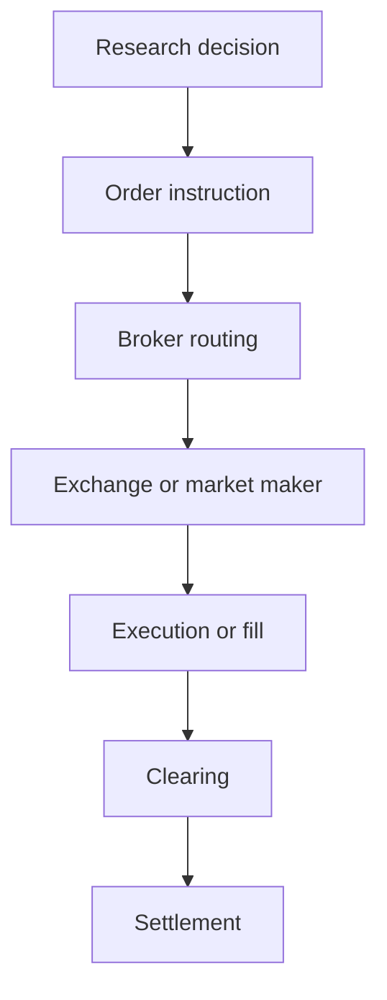

# Equity Trade Lifecycle

A backtest signal is not yet an order. In historical modeling, using the daily open or close is only an execution proxy. In reality, routing choices, bid-ask spread, available liquidity, execution delay, and market impact can cause the realized fill to differ significantly from the proxy price. Standard daily OHLCV data do not reveal queue position, order-book depth, or the actual price that was available for a specific order size at that moment.

## Implication for this project
This project audits daily bars strictly as vendor-produced market summaries. It does not claim or assume that any specific Open, High, Low, or Close field was an achievable execution price.
